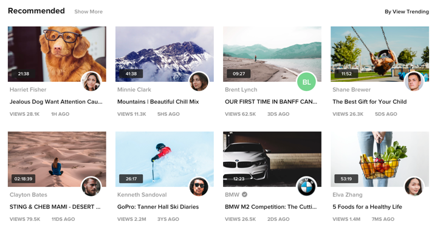

# 🎥 YouTube-Copy Full-Stack Project

This is a complete full-stack application designed as a basic clone of YouTube's core features.

## 💻 Tech Stack & Architecture

This project is built using the following technologies:

| **Service** | **Location** | **Technology Used** | **Key Libraries / Frameworks** |
| :--- | :--- | :--- | :--- |
| **Frontend** | `youtube-copy-frontend/` | **Next.js** (React) | Axios, Classnames, React Hook Form, Tailwind CSS |
| **Backend** | `youtube-copy-backend/` | **NestJS** (Node.js/TypeScript) | NestJS/JWT, Mongoose, Typegoose, bcryptjs |

 
